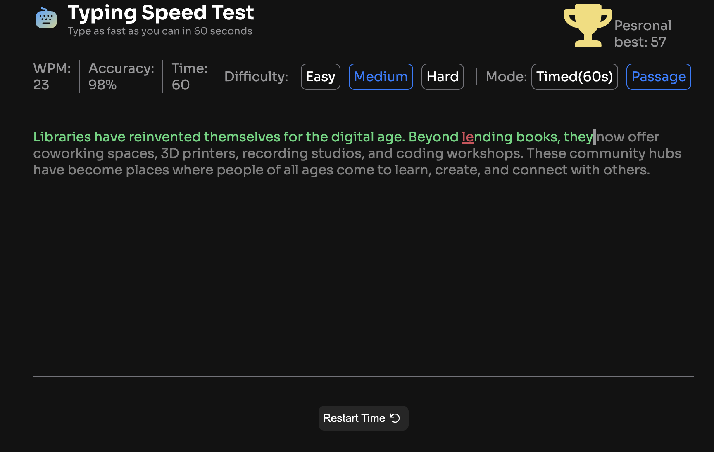

# Frontend Mentor - Typing Speed Test solution

This is a solution to the [Typing Speed Test challenge on Frontend Mentor](https://www.frontendmentor.io/challenges/typing-speed-test). Frontend Mentor challenges help you improve your coding skills by building realistic projects. 

## 📌 Description
Typing Speed Test is a web application that allows users to measure their typing speed and accuracy in real time.  
The app tracks user input, compares it with the reference text, and calculates performance metrics such as WPM (words per minute) and accuracy.

## 🚀 Features
- Real-time typing speed calculation (WPM)
- Accuracy tracking
- Highlighting correct and incorrect characters
- Dynamic text generation
- Timer-based test mode
- Responsive design

## 🖥️ Demo

## ⚙️ How it works

### ⌨️ Typing Logic
User input is compared character-by-character with the reference text.  
Correct and incorrect inputs are visually highlighted in real time.

### ⏱️ Timer System
The test runs for a fixed duration (e.g. 30/60 seconds).  
After time ends, results are calculated and displayed.

### 📊 Metrics
- **WPM (Words Per Minute)** → based on number of correctly typed characters  
- **Accuracy** → percentage of correct inputs  

---

## 🛠️ Tech Stack
- HTML5
- CSS3 (Flexbox)
- JavaScript (Vanilla)

---

## 🧠 What I learned
- Handling real-time user input
- Working with events and keyboard input

---

## 🔄 Future improvements
- Add difficulty levels (easy/medium/hard)
- Custom text input
- Leaderboard / high scores
- Dark mode
- Sound feedback

---

## 👤 Author
- GitHub: https://github.com/MajloszIS
- Frontend Mentor: https://www.frontendmentor.io/profile/MajloszIS